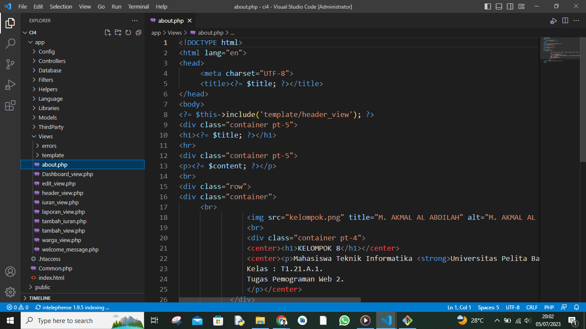
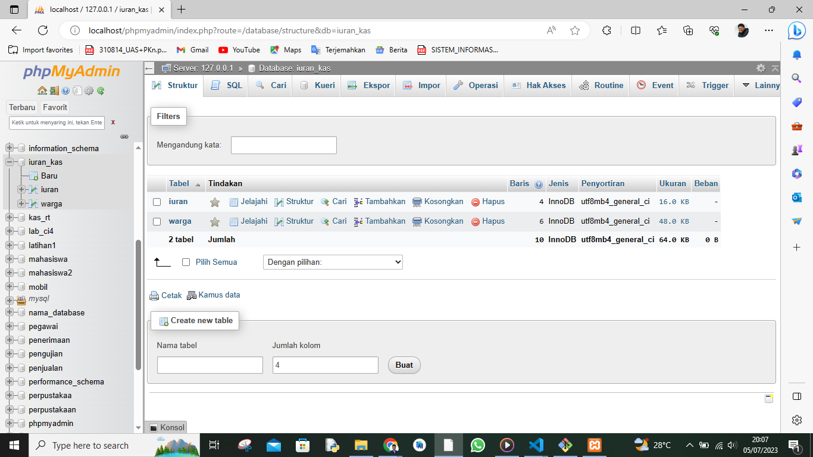
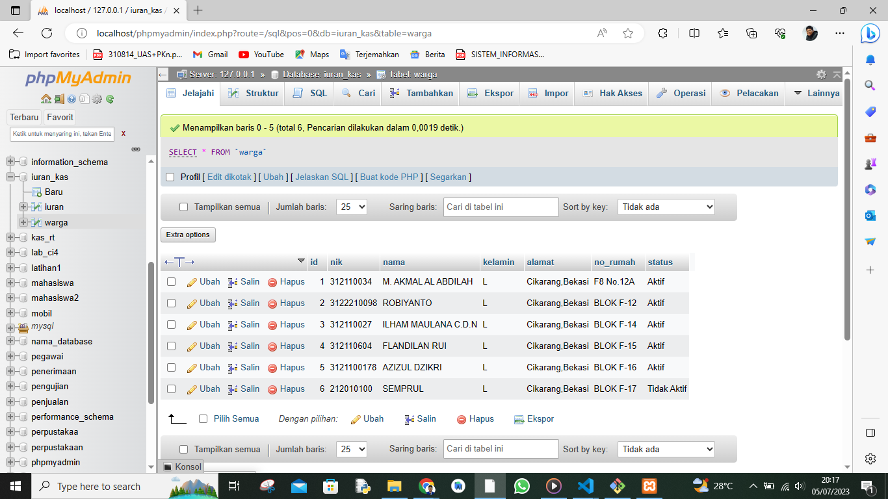
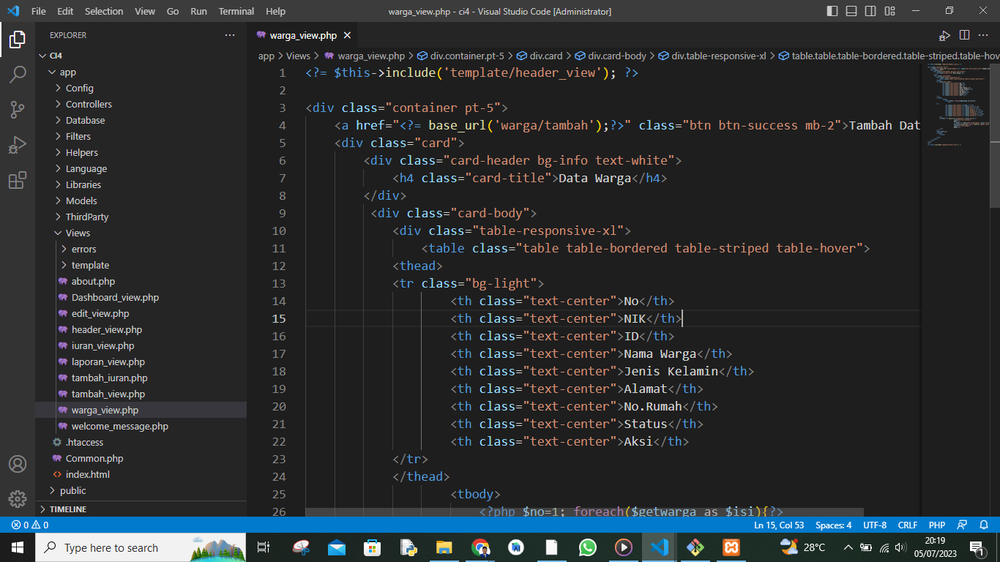
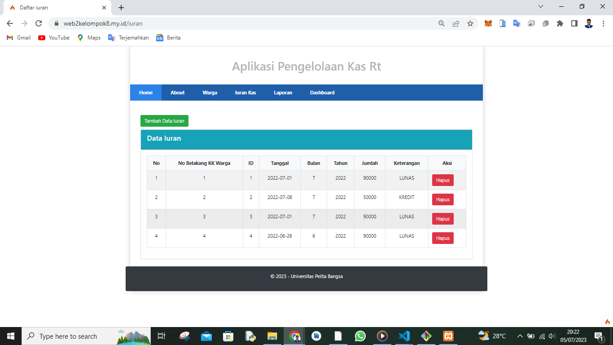
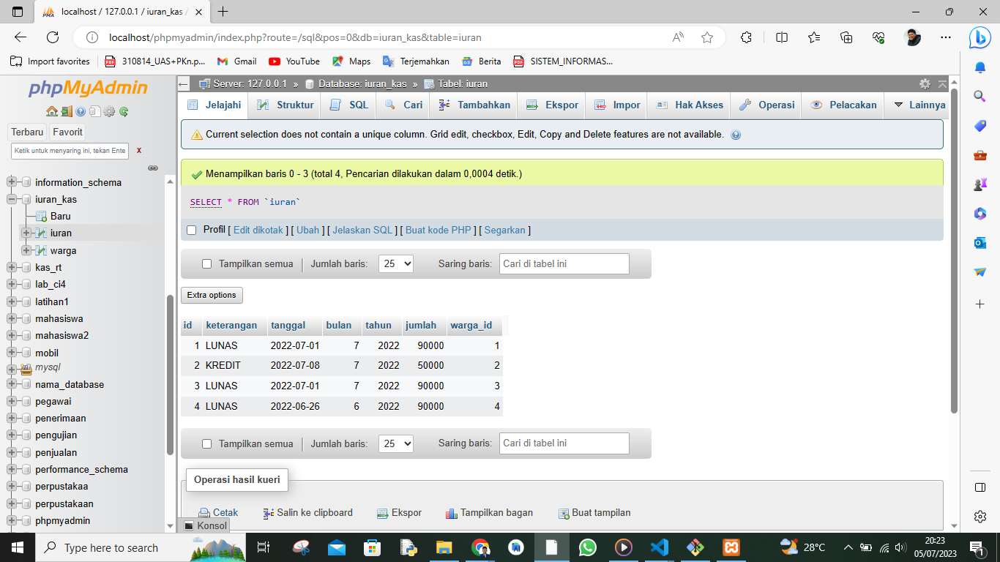
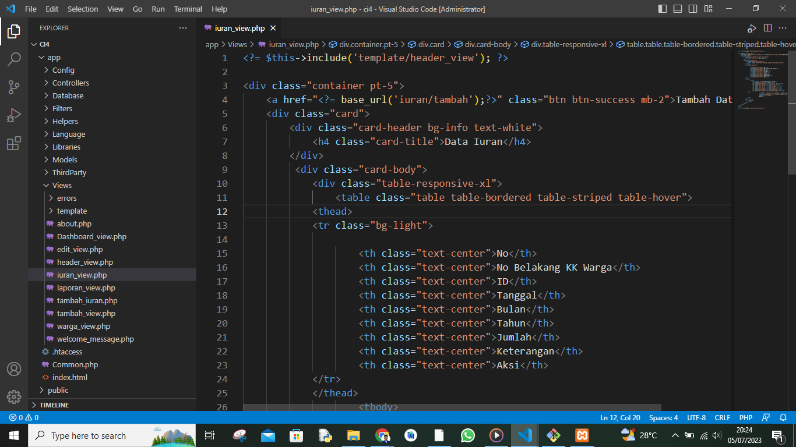
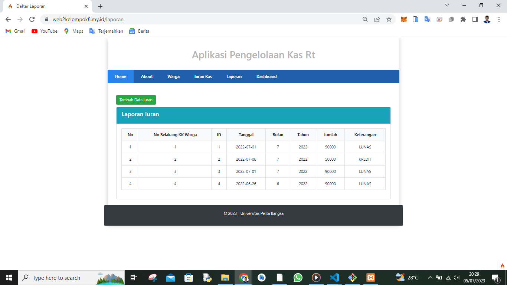

# Pemograman Web2 Pertemuan 16

## Profil
| #               | Biodata                      |
| --------------- | ---------------------------- |
| **Nama**        | M. AKMAL AL ABDILAH          |
| **NIM**         | 312110034                    |
| **Kelas**       | TI.21.A.1                    |
| **Mata Kuliah** | Pemrograman Web 2            |
| **Jabatan**     | Ketua Kelompok 8             |

<p align="center">
 
</p>

<p align="center">
<a href="https://github.com/akmalabdilah"></a>
<p align="center">

<hr>

<a href="https://github.com/akmalabdilah"></a>
<p align="center">

<a href="https://github.com/akmalabdilah"></a>
<p align="center">

<a href="https://github.com/akmalabdilah"></a>
<p align="center">

<a href="https://github.com/akmalabdilah"></a>
<p align="center">

<hr>

<hr>

## Uas Pemograman Web 2 : Sistem Pengelolaan Kas Rt

<hr>

<hr>

## Anggota Kelompok 8
| Nim              | Nama                          | Jabatan        |
| ---------------- | ----------------------------- | -------------- |
| **312110034**    | M. AKMAL AL ABDILAH           | Ketua          |
| **312210098**    | ROBIYANTO                     | Wakil          |
| **312110027**    | ILHAM MAULANA CHAKRA DWI NOTO | Perancangan    |
| **312110604**    | FLANDILAN RUI                 | Sistem analis  |
| **3121100178**   | MUHAMAD AZIZUL DZIKRI         | pemograman     |

<hr>

<hr>

## Link Hosting 1 : https://web2kelompok8.my.id/about 
## Link Hosting 2 : https://kelompokdelapanwebdua.000webhostapp.com/about
## Link Youtube: 

<hr>
 
 **`Tampilan sistem di web`**
 


 Tampilan Sistem


<hr>

## 312110034 M. AKMAL AL ABDILAH

<hr>

<p>
Disini saya sebagai ketua kelompok 8 akan menjelaskan cara pembuatan sistem seperti gambar di atas di bagian hosting  sisanya seperti menu dan database akan di jelaskan oleh anggota kelompok dan wakil saya.
</p>


<p>
Saya dua hosting seperti link yang di atas kenapa dua hosting karna satu hosting berbayar cpanel hanya satu bulan saja masa aktifnya sedangkan hosting satu lagi yang geratisan selamannya.
</p>

<hr>

## Cara mengaupload file ci4 di hosting berbayar cpanel

<hr>

<p>
1. Kalian masuk akun cpanel kalian
</P>


<p>
2. Kalian cari dan masuk pada menu file manage.
</P>


<p>
3. Setelah itu kalian akan di sugukan tampilan seperti ini.
</P>


<p>
Jangan lupa di dalam file manager ini langsung kalian cari bacaan +folder dan namain folder itu dengan nama ci4 setelah itu masuk folder ci4 dan kalian cari bacaan upload di atas kalian di dalam folder ci4 dan upload file ci4 kalian jangan lupa zip terlebih dahulu.
</p>


<p>
4. Setelah itu kalian extrak file zip ci4 di folder ci4 kalian.
</P>


<p>
5. Setelah itu kalian setting dulu seperti gambar di bawah.
</P>


<p>
6. Setelah itu kalian kembali ke menu utama cpanel dan kita cari menu database wizard seperti gambar di bawah 
kalian ikuti gambar dibawah supaya kalian paham.
</P>


<p>
Kembali ke menu utama cari menu phpmyadmin dan masuk menu itu kita masukan file database yang sudah kita buat atau kalian bisa membuat langsung databasnya di menu ini.
</p>


<p>
7. Setelah itu kalian kalian kembali ke menu utama dan masuk kembali ke file maneger mausuk ke folder ci4 carai file .env ubah file nya seperti di gambar bawah.

catatan: sesuaikan dengan nama domain nama database nama userdatabe serta password yangb kalian buat.
</P>


<p>
8. karna penjelasan banyak kalian ikuti saja gambar dibawah

</P>


<p>masuk ke menu ci4/app/config/app.php</p>


<p>masuk ke menu ci4/app/config/database.php</p>

<p> Sekarang kalian sudah memiliki web hosting cpanel online dengan database dan cara menseting hosting gratisan di link kedua kurang lebih sama cuman beda tampilan saja oke semoga berhasil.
Sisa penjelasan nanti di jelaskan oleh kawan saya. </p>


<hr>

## 312210098 ROBIYANTO 

<hr>

<hr>

## Menu about dan database

<hr>

<p>
Disini saya sebagai wakil kelompok 8 akan menjelaskan menu about dan database.
</p>

<p>
1. Apa itu menu about?
</P>


<p>
Menu "About" dalam sebuah web hosting adalah halaman yang berisi informasi tentang perusahaan web hosting tersebut. Halaman ini dirancang untuk memberikan penjelasan dan latar belakang perusahaan kepada pengunjung situs web.
</p>

<p>
Bagaimana cara membuaatnya saya berikan codennya di atas kalian bisa mencobaannya langsung dan bisa melihat susunanya.
</p>

<p>
Kode about dan penempatannya di ci4.
</p>

```php
<!DOCTYPE html>
<html lang="en">
<head>
     <meta charset="UTF-8">
     <title><?= $title; ?></title>
</head>
<body>
<?= $this->include('template/header_view'); ?>
<div class="container pt-5">
<h1><?= $title; ?></h1>
<hr>
<div class="container pt-5">
<p><?= $content; ?></p>
<br>
<div class="row">
<div class="container">
     <br>
                
                <br>
                <div class="container pt-4">
                <center><h1>KELOMPOK 8</h1></center>
                <center><p>Mahasiswa Teknik Informatika <strong>Universitas Pelita Bangsa</strong> 
                Kelas : T1.21.A.1.
                Tugas Pemograman Web 2.
                </p></center>
            </div>
            <br>
<?= $this->include('template/footer_view'); ?>
</body>
</html>
```



<p>
2. Apa itu database?
</P>

<p>
Dalam pemrograman, database merujuk pada koleksi terstruktur data yang disimpan dan diorganisir secara elektronik. Database digunakan untuk menyimpan informasi yang relevan dengan suatu aplikasi atau sistem. Ini adalah komponen penting dalam banyak aplikasi perangkat lunak yang melibatkan penyimpanan, pengambilan, dan manipulasi data.
</p>

<p>
Dibawah ini adalah gambar struktur database yang kami pakai.
</p>



<p>
Sekarang kalian sudah memiliki sudah tau apa itu menu about dan database.
Sisa penjelasan nanti di jelaskan oleh rekan satu kelompok saya.
</p>

<hr>

## 312110027 ILHAM MAULANA CHAKRA DWI NOTO

<hr>

<hr>

## Menu Warga dan database

<hr>

<p>
Disini saya sebagai perancang kelompok 8 akan menjelaskan menu warga di dalam web hosting yang kami buat dan database.
</p>

<p>
1. Apa itu menu warga?
</P>


<p>
Menu "Warga" ini menampilkan semua data warga yang telah di simpan di dalam database saya lampirkan struktur database warga dan kode menu about serta penempatan kode di ci4.
</p>



```php
<?= $this->include('template/header_view'); ?>

<div class="container pt-5">
    <a href="<?= base_url('warga/tambah');?>" class="btn btn-success mb-2">Tambah Data</a>
    <div class="card">
        <div class="card-header bg-info text-white">
            <h4 class="card-title">Data Warga</h4>
        </div>
         <div class="card-body">
            <div class="table-responsive-xl">
                <table class="table table-bordered table-striped table-hover">
            <thead>
            <tr class="bg-light">
                    <th class="text-center">No</th>
                    <th class="text-center">NIK</th>
                    <th class="text-center">ID</th>
                    <th class="text-center">Nama Warga</th>
                    <th class="text-center">Jenis Kelamin</th>
                    <th class="text-center">Alamat</th>
                    <th class="text-center">No.Rumah</th>
                    <th class="text-center">Status</th>
                    <th class="text-center">Aksi</th>
            </tr>
            </thead>
                    <tbody>
                        <?php $no=1; foreach($getwarga as $isi){?>
                            <tr>
            <tr>
                        <td class="text-center"><?=$no; ?></td>
                        <td class="text-center"><?= $isi['nik'];?></td>
                        <td class="text-center"><?= $isi['id'];?></td>
                        <td class="text-center"><?= $isi['nama']; ?></td>
                        <td class="text-center"><?= $isi['kelamin']; ?></td>
                        <td class="text-center"><?= $isi['alamat']; ?></td>
                        <td class="text-center"><?= $isi['no_rumah']; ?></td>
                        <td class="text-center"><?= $isi['status']; ?></td>
                <td>
                <a href="<?= base_url('warga/edit/'.$isi['id']);?>" 
                                    class="btn btn-success">
                                    Edit</a>
                                    <a href="<?= base_url('warga/hapus/'.$isi['id']);?>" 
                                    onclick="javascript:return confirm('Apakah ingin menghapus data Warga ?')"
                                    class="btn btn-danger">
                                    Hapus</a>
                </td>
            </tr>
            <?php $no++;}?>
            </tbody>  
                </table>
              
            </div>
        </div>
    </div>
</div>
<br>
<?= $this->include('template/footer_view'); ?>
```



<p>
Sekarang kalian sudah memiliki sudah tau apa itu menu warga dan database.
Sisa penjelasan nanti di jelaskan oleh rekan satu kelompok saya.
</p>


<hr>

## 312110604 FLANDILAN RUI 

<hr>

<hr>

## Menu iuran kas dan database

<hr>

<p>
Disini saya sebagai sistem analis kelompok 8 akan menjelaskan menu iuran kas di dalam web hosting yang kami buat dan database.
</p>

<p>
1. Apa itu menu iuran kas?
</P>



<p>
Menu "iuran kas" ini menampilkan semua data kas warga yang telah di simpan di dalam database saya lampirkan struktur database warga dan kode menu about serta penempatan kode di ci4.
</p>



```php
<?= $this->include('template/header_view'); ?>

<div class="container pt-5">
    <a href="<?= base_url('iuran/tambah');?>" class="btn btn-success mb-2">Tambah Data Iuran</a>
    <div class="card">
        <div class="card-header bg-info text-white">
            <h4 class="card-title">Data Iuran</h4>
        </div>
         <div class="card-body">
            <div class="table-responsive-xl">
                <table class="table table-bordered table-striped table-hover">
            <thead>
            <tr class="bg-light">
                    
                    <th class="text-center">No</th>
                    <th class="text-center">No Belakang KK Warga</th>  
                    <th class="text-center">ID</th>
                    <th class="text-center">Tanggal</th>
                    <th class="text-center">Bulan</th>
                    <th class="text-center">Tahun</th>
                    <th class="text-center">Jumlah</th>
                    <th class="text-center">Keterangan</th>
                    <th class="text-center">Aksi</th>
            </tr>
            </thead>
                    <tbody>
                        <?php $no=1; foreach($getiuran as $isi){?>
                        <td class="text-center"><?=$no; ?></td>
                        <td class="text-center"><?= $isi['warga_id']; ?></td>
                        <td class="text-center"><?= $isi['id']; ?></td>
                        <td class="text-center"><?= $isi['tanggal']; ?></td>
                        <td class="text-center"><?= $isi['bulan']; ?></td>
                        <td class="text-center"><?= $isi['tahun']; ?></td>
                        <td class="text-center"><?= $isi['jumlah']; ?></td>
                        <td class="text-center"><?= $isi['keterangan']; ?></td>
                <td>
                                    <a href="<?= base_url('iuran/hapus/'.$isi['id']);?>" 
                                    onclick="javascript:return confirm('Apakah ingin menghapus data iuran ?')"
                                    class="btn btn-danger">
                                    Hapus</a>
                </td>
            </tr>
            <?php $no++;}?>
                </table>
            </div>
        </div>
    </div>
</div>
<br>
<?= $this->include('template/footer_view'); ?>
```



<p>
Sekarang kalian sudah memiliki sudah tau apa itu menu iuran kas dan database.
Sisa penjelasan nanti di jelaskan oleh rekan satu kelompok saya.
</p>


<hr>

## 3121100178 MUHAMAD AZIZUL DZIKRI 

<hr>

<hr>

## Menu laporan

<hr>

<p>
Disini saya sebagai seorang pemograman kelompok 8 akan menjelaskan menu laporan di dalam web hosting yang kami buat.
</p>

<p>
1. Apa itu menu laporan?
</P>



<p>
Menu "laporan" ini menampilkan semua data dari iuran kas yang telah di pisahkan dan di arsipkan agar mempermudah pendataan akhir.
</p>


  <hr>
  
  Cukup Sekian Penjelasan Dari kami kelompok 8 tentang pembuatan sistem iuran kas rt dengan hosting dan fremwork ci4 kurang lebih kami mohon maaf.
  **SELESAI**
  <hr>

<div>
<h2 align="center">Thanks For Reading!!!</h2>
<div align="center">


