# Pemograman Web2 Pertemuan 16

## Profil
| #               | Biodata                      |
| --------------- | ---------------------------- |
| **Nama**        | M. AKMAL AL ABDILAH          |
| **NIM**         | 312110034                    |
| **Kelas**       | TI.21.A.1                    |
| **Mata Kuliah** | Pemrograman Web 2            |
| **Jabatan**     | Ketua Kelompok 8             |

 

## Uas Pemograman Web 2 : Sistem Pengelolaan Kas Rt

## Anggota Kelompok 8
| Nim              | Nama                          | Jabatan        |
| ---------------- | ----------------------------- | -------------- |
| **312110034**    | M. AKMAL AL ABDILAH           | Ketua          |
| **312210098**    | ROBIYANTO                     | Wakil          |
| **312110027**    | ILHAM MAULANA CHAKRA DWI NOTO | Perancangan    |
| **312110604**    | FLANDILAN RUI                 | Sistem analis  |
| **3121100178**   | MUHAMAD AZIZUL DZIKRI         | Progamer       |

## Link Hosting 1 : https://web2kelompok8.my.id/about 
## Link Hosting 2 : https://kelompokdelapanwebdua.000webhostapp.com/about
## Link Youtube: 

 
 **`Tampilan sistem di web`**
 

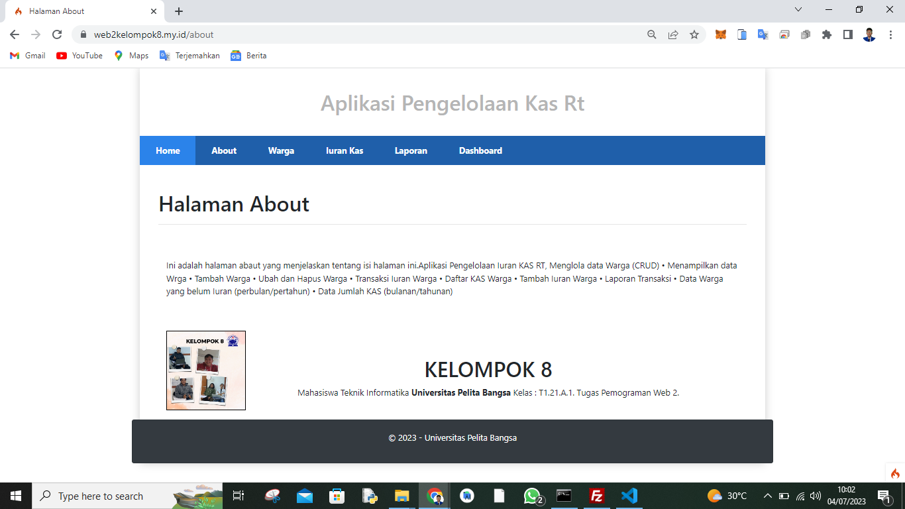
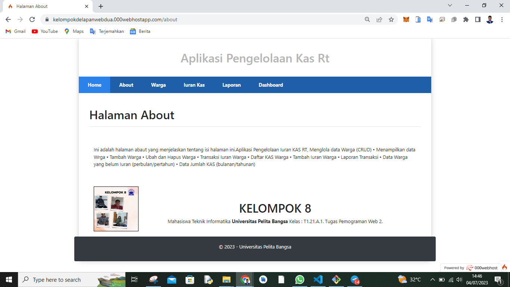

 Tampilan Sistem

## 312110034 M. AKMAL AL ABDILAH

Disini saya sebagai ketua kelompok 8 akan menjelaskan cara pembuatan sistem seperti gambar di atas di bagian hosting  sisanya seperti menu dan database akan di jelaskan oleh anggota kelompok dan wakil saya.

Saya dua hosting seperti link yang di atas kenapa dua hosting karna satu hosting berbayar cpanel hanya satu bulan saja masa aktifnya sedangkan hosting satu lagi yang geratisan selamannya

## Cara mengaupload file ci4 di hosting berbayar cpanel

1. Kalian masuk akun cpanel kalian

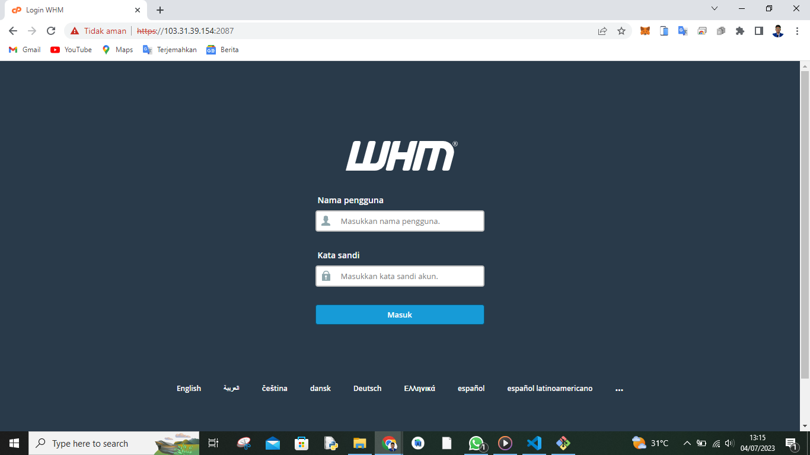
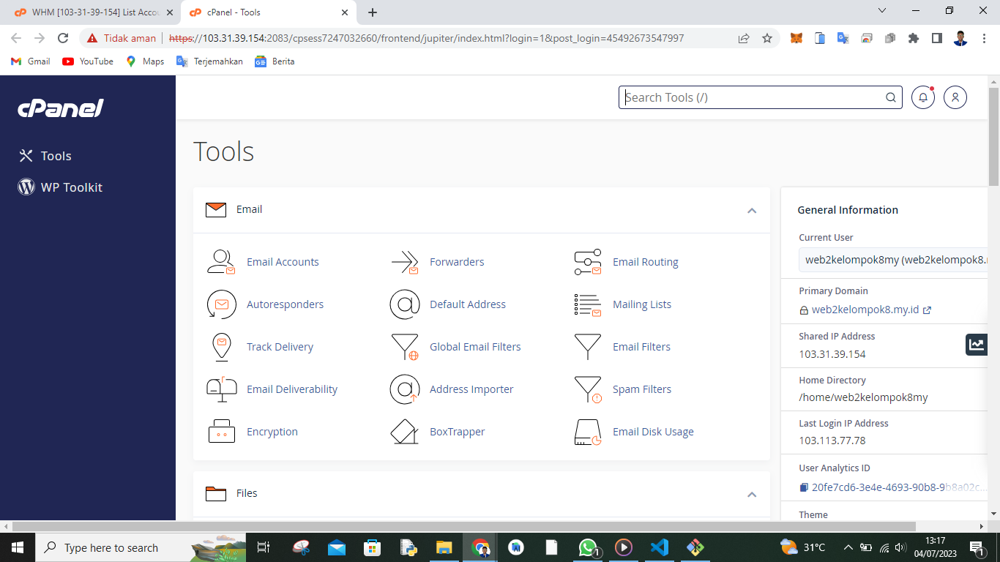

2. Kalian cari dan masuk pada menu file manager

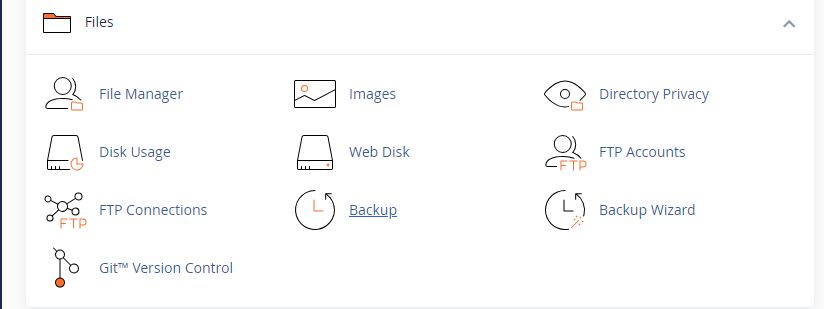

3. Setelah itu kalian akan di sugukan tampilan seperti ini 

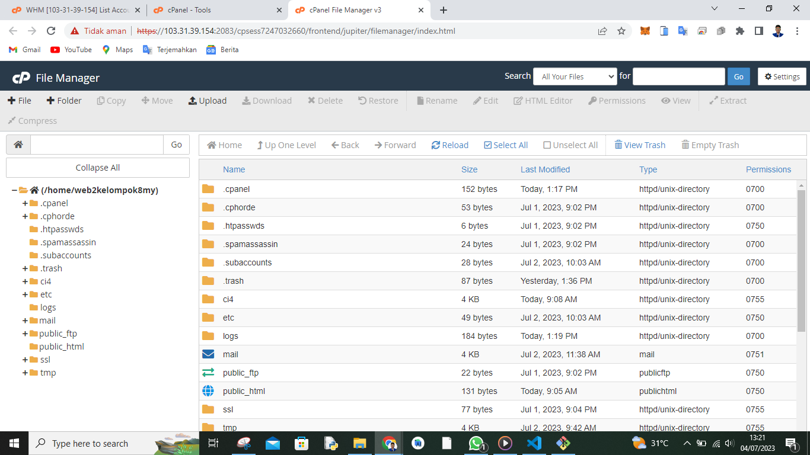

Jangan lupa di dalam file manager ini langsung kalian cari bacaan +folder dan namain folder itu dengan nama ci4 setelah itu masuk folder ci4 dan kalian cari bacaan upload di atas kalian di dalam folder ci4 dan upload file ci4 kalian jangan lupa zip terlebih dahulu.

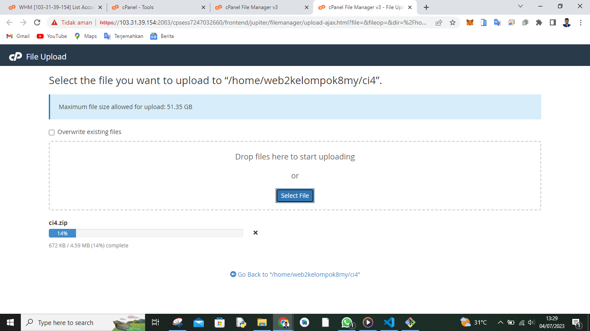

4. Setelah itu kalian extrak file zip ci4 di folder ci4 kalian

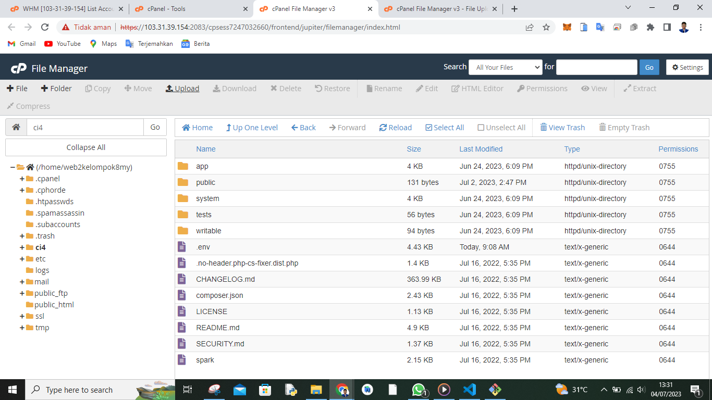

5. Setelah itu kalian setting dulu seperti gambar di bawah

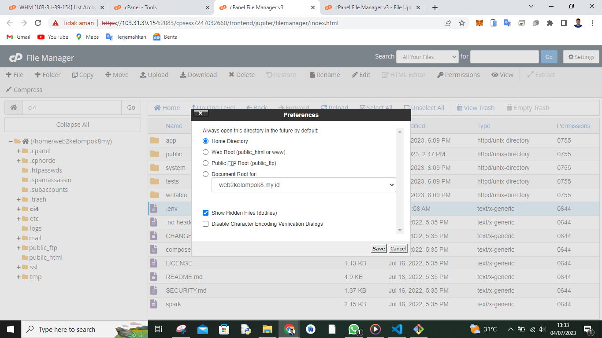

6. Setelah itu kalian kembali ke menu utama cpanel dan kita cari menu database wizard seperti gambar di bawah 
kalian ikuti gambar dibawah supaya kalian paham.

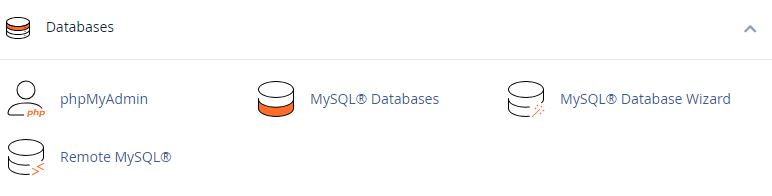
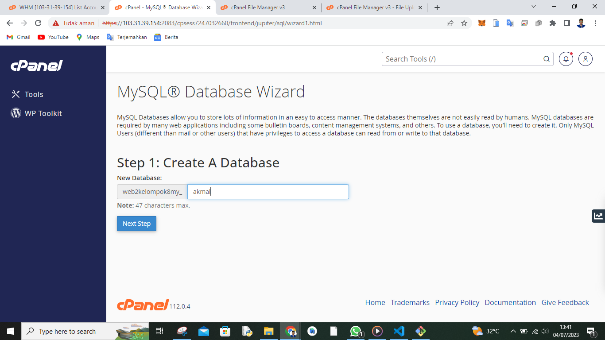
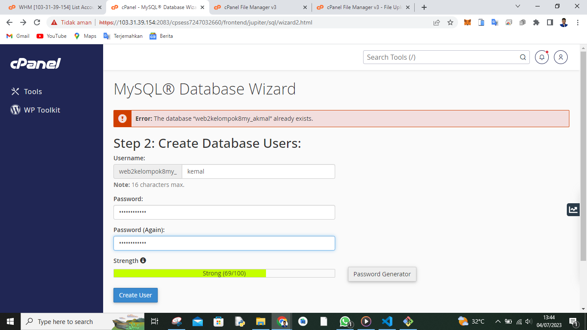
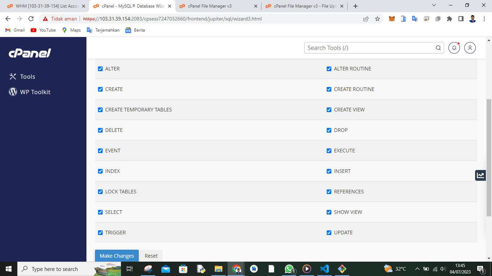
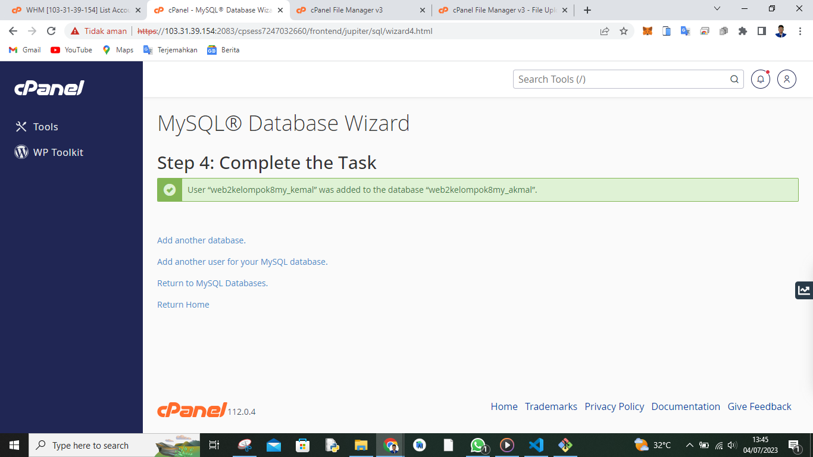

Kembali ke menu utama cari menu phpmyadmin dan masuk menu itu kita masukan file database yang sudah kita buat atau kalian bisa membuat langsung databasnya di menu ini

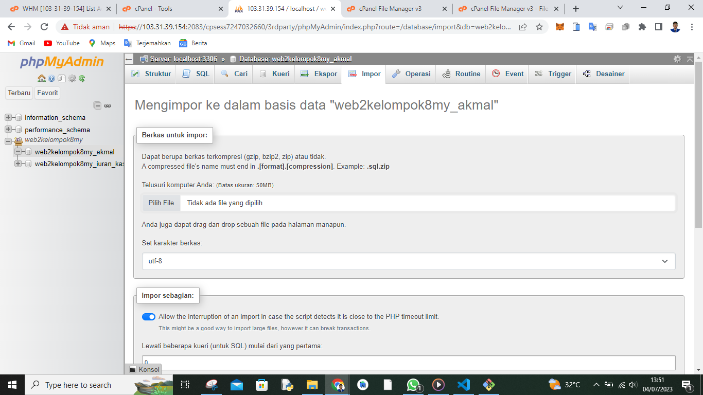

7. Setelah itu kalian kalian kembali ke menu utama dan masuk kembali ke file maneger mausuk ke folder ci4 carai file .env ubah file nya seperti di gambar bawah

catatan: sesuaikan dengan nama domain nama database nama userdatabe serta password yangb kalian buat

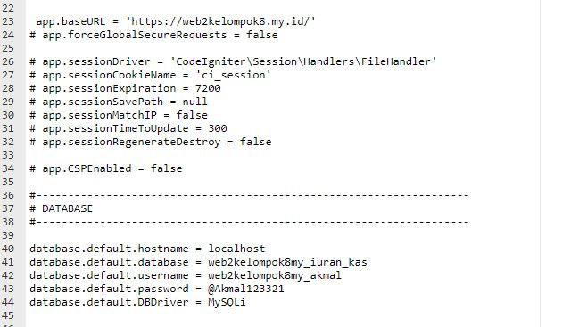

8. karna penjelasan banyak kalian ikuti saja gambar dibawah

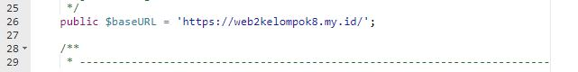

masuk ke menu ci4/app/config/app.php

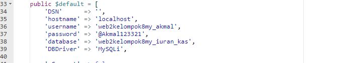

masuk ke menu ci4/app/config/database.php

 Sekarang kalian sudah memiliki web hosting cpanel online dengan database dan cara menseting hosting gratisan di link kedua kurang lebih sama cuman beda tampilan saja oke semoga berhasil.

Sisa penjelasan nanti di jelaskan oleh kawan saya. 

  

  
  Cukup Sekian Penjelasan Dari saya sisa penjelasan akan di jelaskan oleh rekan kelompok saya di link video youtube.
  
  **SELESAI**
  

<h2 align="center">Thanks For Reading!!!</h2>

